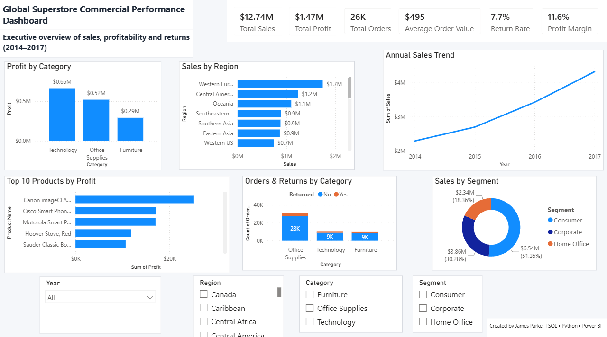
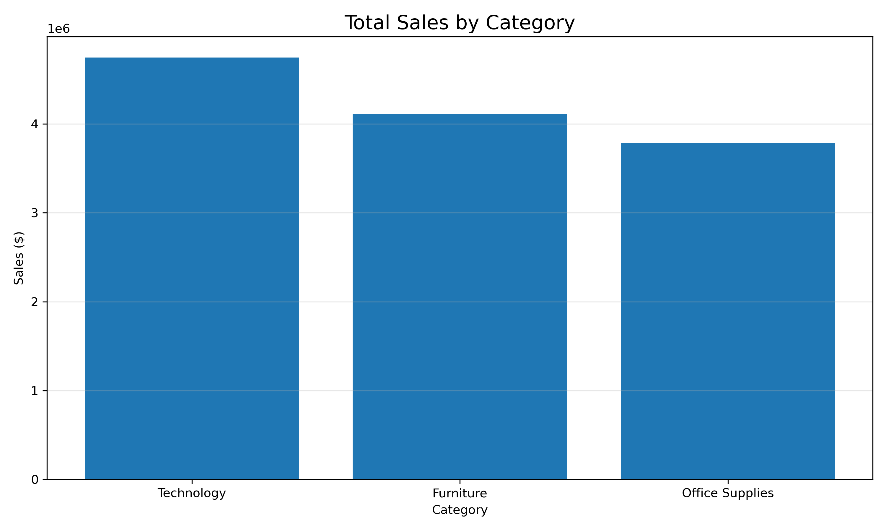
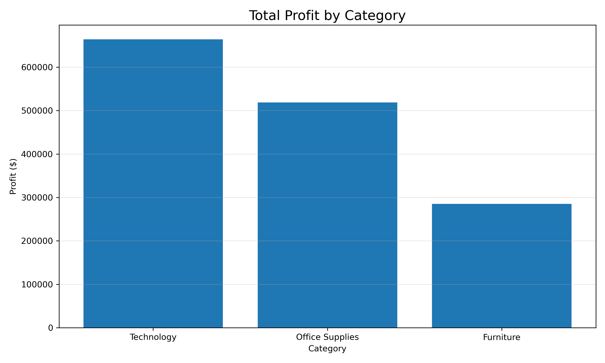
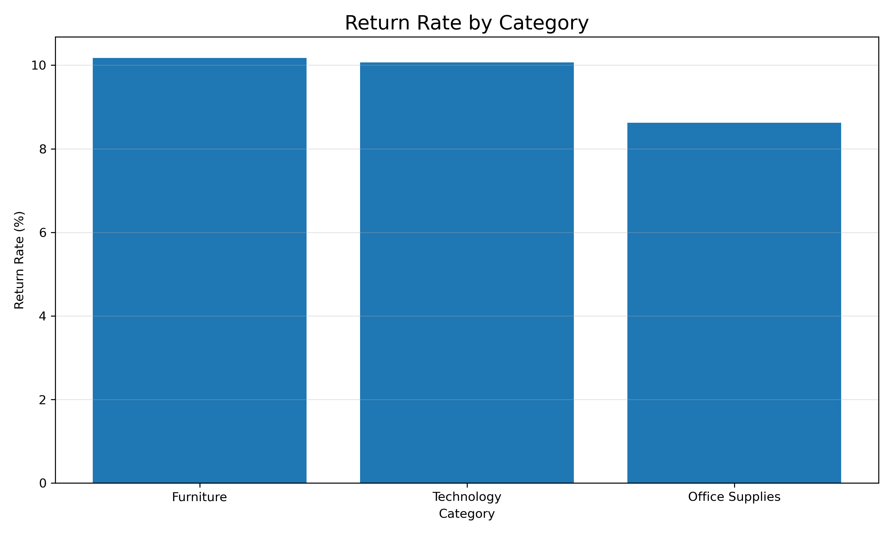
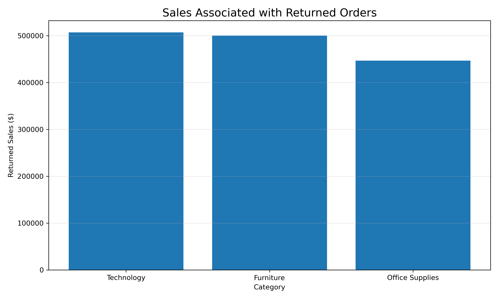
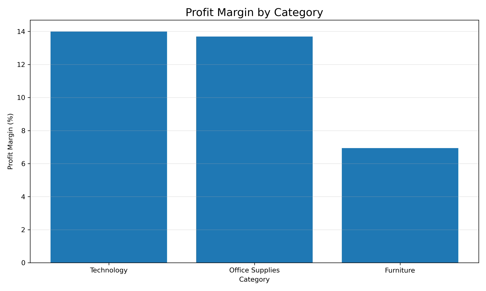
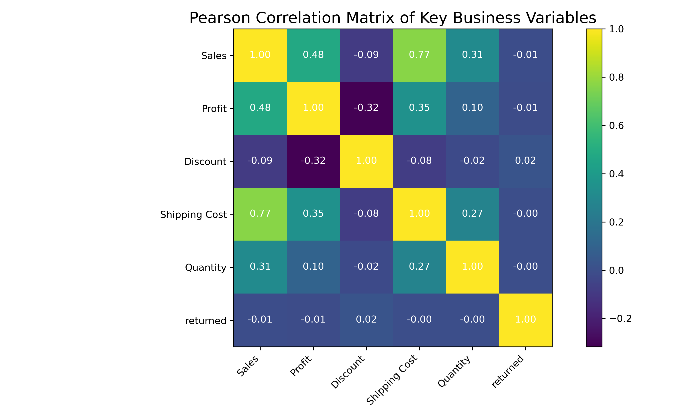
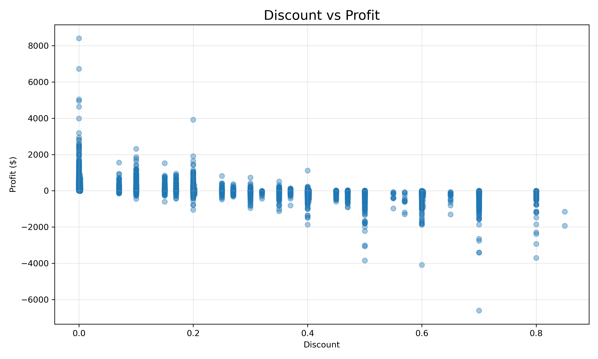
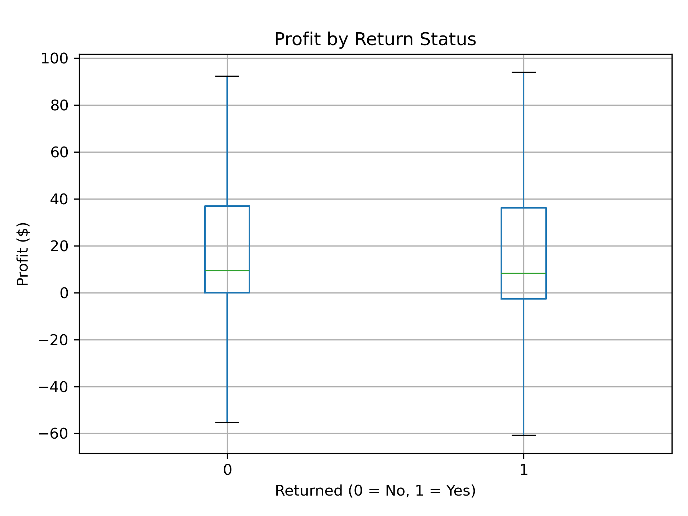

# 📊 Commercial Performance & Returns Analysis
### End-to-End Retail Analytics Project



> **An end-to-end commercial analytics project using SQL, Python, SQLite and Power BI to investigate sales performance, profitability and customer returns across a global retail business.**

---

## Technology Stack


---

# Executive Summary

This project demonstrates an end-to-end commercial analytics workflow designed to investigate the sales performance, profitability and customer return behaviour of a global retail business.

Starting with the original **Global Superstore** dataset, the project progressed through each stage of the analytics lifecycle. Raw transactional data was cleaned and transformed using **Python (Pandas)** before being separated into relational datasets representing **Orders**, **Returns** and **People**. These datasets were then loaded into a **SQLite** database, where SQL was used to validate the data and investigate key commercial questions surrounding sales performance, profitability and the financial impact of customer returns.

Following the SQL analysis, Python was used to perform exploratory data analysis, statistical modelling and hypothesis testing. Techniques including correlation analysis, Welch's Independent Samples t-test, Cohen's d effect size, multiple linear regression and Variance Inflation Factor (VIF) analysis were applied to investigate the factors influencing profitability and determine whether customer returns significantly affected business performance.

The final stage of the project involved developing an interactive **Power BI Executive Dashboard** featuring dynamic KPI cards, interactive filtering and commercial visualisations, enabling business stakeholders to explore sales, profitability and return performance across multiple dimensions.

---

### Key Findings

- Analysed **51,290 sales transactions** across **25,728 customer orders**.
- Generated **£12.64 million** in total sales and **£1.47 million** in total profit.
- Identified **Technology** as the company's strongest commercial category, delivering both the highest sales and highest profit.
- Determined that **Furniture** consistently underperformed due to weaker margins, higher average discounting and elevated return rates.
- Discovered that the **Tables** sub-category generated an overall financial loss despite strong revenue, highlighting a significant commercial concern.
- Demonstrated that customer returns alone did **not** explain the poor profitability of Tables, challenging the initial business hypothesis.
- Identified **discounting** as the strongest commercial factor associated with declining profitability.
- Distinguished between **statistical significance** and **practical commercial significance** by combining hypothesis testing with effect size analysis.
- Delivered an interactive Power BI dashboard to support evidence-based commercial decision-making.

The project demonstrates the complete analytics process from data preparation and database design through to statistical analysis, business intelligence and executive reporting, reflecting the responsibilities typically expected of a Commercial Data Analyst or Business Intelligence Analyst.

# Business Problem

Retail organisations generate vast quantities of transactional sales data every day. While this data contains valuable commercial insights, raw transaction records alone provide limited value without structured analysis. Business leaders require evidence-based insights to understand which products, categories and regions drive profitability, where financial losses occur, and how operational factors such as discounting and customer returns influence commercial performance.

The objective of this project was to investigate the commercial performance of a global retail business by analysing sales transactions, profitability and return behaviour using an end-to-end analytics workflow. Rather than simply reporting historical sales figures, the project aimed to identify the underlying commercial drivers influencing business performance and provide actionable recommendations capable of supporting strategic decision-making.

Several key business questions guided the investigation:

- Which product categories generate the highest sales and profitability?
- Which products and categories underperform financially despite generating revenue?
- How do customer returns affect overall business profitability?
- Which commercial factors have the greatest influence on profit?
- Are returned orders significantly less profitable than non-returned orders?
- Can statistical modelling identify the primary drivers of profitability?
- How can business stakeholders monitor commercial performance through an interactive dashboard?

Answering these questions required integrating SQL, Python, statistical analysis and Power BI to transform raw transactional data into meaningful commercial intelligence suitable for executive decision-making.

# Project Objectives

The primary objective of this project was to develop a complete commercial analytics solution that demonstrates the full analytics lifecycle, from raw data preparation through to executive reporting.

The project objectives were to:

- Clean and prepare raw retail transaction data using Python.
- Create a structured relational database using SQLite.
- Validate data quality prior to analysis.
- Perform exploratory and commercial analysis using Python.
- Investigate profitability across products, categories and regions.
- Analyse customer return behaviour and quantify its financial impact.
- Apply statistical techniques to test business hypotheses and identify key profitability drivers.
- Build an interactive Power BI dashboard for executive reporting.
- Translate analytical findings into evidence-based commercial recommendations.

# Dataset Overview

The analysis is based on the **Global Superstore** dataset, a comprehensive retail sales dataset containing transactional, customer and operational information for a multinational retail organisation.

The original Excel workbook was transformed into a structured relational dataset consisting of three linked tables:

| Table | Description |
|--------|-------------|
| **Orders** | Transaction-level sales data containing customer information, product details, pricing, discounts, shipping costs and profit. |
| **Returns** | Customer return records linked to individual orders. |
| **People** | Regional manager information used to provide organisational context. |

The resulting analytical dataset contains:

| Metric | Value |
|--------|------:|
| Total Sales Transactions | **51,290** |
| Unique Customer Orders | **25,728** |
| Customers | **17,415** |
| Products | **3,788** |
| Product Categories | **3** |
| Product Sub-Categories | **17** |
| Countries | **165** |
| Regions | **23** |
| Markets | **5** |
| Analysis Period | **2014–2017** |

The dataset provides sufficient breadth to investigate commercial performance across multiple business dimensions, including product performance, regional sales, customer returns, pricing strategy and profitability.

# Project Workflow

The project follows a complete end-to-end commercial analytics workflow, replicating the analytical process commonly used within business intelligence and commercial analytics teams.

```text
Global Superstore Excel Dataset
                │
                ▼
Python Data Preparation
(Data Cleaning & Transformation)
                │
                ▼
orders.csv | returns.csv | people.csv
                │
                ▼
SQLite Database
                │
                ▼
SQL Business Analysis
                │
                ▼
Python Exploratory & Statistical Analysis
                │
                ▼
Power BI Executive Dashboard
                │
                ▼
Commercial Insights & Management Recommendations
```

This structured workflow demonstrates the complete analytics lifecycle, beginning with raw data preparation and progressing through database development, business analysis, statistical investigation and executive reporting.


# Technical Implementation

The project was developed using a modern analytics workflow combining **Python**, **SQLite**, **SQL** and **Power BI**. Each technology was used to solve a specific stage of the analytical process, from data preparation through to business intelligence reporting.

---

## Python

Python was used throughout the project for data preparation, exploratory data analysis and statistical modelling.

Key tasks included:

- Importing and cleaning the original Global Superstore dataset using **Pandas**.
- Splitting the source dataset into relational **Orders**, **Returns** and **People** tables.
- Exporting cleaned datasets to CSV format.
- Performing exploratory data analysis (EDA).
- Creating visualisations using **Matplotlib**.
- Conducting correlation analysis to investigate relationships between commercial variables.
- Performing Welch's Independent Samples t-test to compare returned and non-returned orders.
- Measuring practical significance using **Cohen's d** effect size.
- Building multiple linear regression models to identify the strongest predictors of profitability.
- Assessing multicollinearity using Variance Inflation Factor (VIF).

---

## SQLite & SQL

SQLite was used to create a structured relational database before performing commercial analysis using SQL.

SQL analysis focused on answering key business questions relating to:

- Database validation and data quality.
- Sales performance by category, sub-category and region.
- Product and category profitability.
- Customer return behaviour.
- Financial impact of returned orders.
- Return rate analysis.
- Discount analysis.
- Identification of high-performing and underperforming products.
- Commercial drivers influencing profitability.

The SQL analysis formed the foundation for the subsequent statistical investigation conducted in Python.

---

## Power BI

The final stage of the project involved building an interactive executive dashboard designed to support commercial decision-making.

The dashboard includes:

- Executive KPI cards.
- Sales performance analysis.
- Profitability analysis.
- Regional sales performance.
- Annual sales trends.
- Product-level profitability.
- Customer return analysis.
- Interactive slicers for Year, Region, Category and Segment.
- Dynamic filtering across all visuals using DAX measures.

Custom DAX measures were developed to calculate:

- Total Sales
- Total Profit
- Total Orders
- Average Order Value
- Return Rate
- Profit Margin

The dashboard provides an interactive business intelligence solution that enables stakeholders to explore commercial performance across multiple business dimensions.

# SQL Analysis

SQL was used to validate the database, explore commercial performance and answer structured business questions before extending the analysis in Python and Power BI.

The SQL analysis was organised into six scripts, each representing a separate stage of the investigation.

---

## 1. Database Validation

**File:** `SQL/01_database_validation.sql`

The first stage focused on validating the imported SQLite database to ensure the data was suitable for analysis.

This included:

- Checking table row counts.
- Confirming successful import of Orders, Returns and People tables.
- Validating unique order, customer and product counts.
- Reviewing the scale of countries, regions, markets, categories and sub-categories.

This step confirmed that the database contained:

| Metric | Value |
|--------|------:|
| Order Lines | **51,290** |
| Unique Orders | **25,728** |
| Unique Customers | **17,415** |
| Unique Products | **3,788** |
| Countries | **165** |
| Regions | **23** |
| Markets | **5** |

This provided confidence that the analysis was based on a complete and correctly imported dataset.

---

## 2. Exploratory Commercial Analysis

**File:** `SQL/02_exploratory_analysis.sql`

The exploratory SQL analysis established the project's headline commercial KPIs and identified early patterns across categories, products and regions.

Key questions answered included:

- What are total sales, profit and order volumes?
- Which product categories generate the highest sales?
- Which categories generate the highest profit?
- Which sub-categories and products drive revenue?
- How does discounting vary across categories?
- Which product groups have the highest shipping costs?

Key headline metrics included:

| KPI | Value |
|-----|------:|
| Total Sales | **$12.64M** |
| Total Profit | **$1.47M** |
| Total Orders | **25,728** |
| Total Quantity Sold | **178,312** |
| Average Order Value | **$491.39** |
| Average Discount | **14%** |

This phase identified **Technology** as the strongest revenue-generating category and highlighted **Furniture** as a category requiring further investigation due to comparatively weak profitability.

---

## 3. Profitability Analysis

**File:** `SQL/03_profitability_analysis.sql`

Profitability analysis moved beyond sales revenue to evaluate how effectively different products, categories and regions converted revenue into profit.

This included:

- Profit margin by category.
- Profit margin by sub-category.
- Country-level profitability.
- Market-level profitability.
- Regional profitability.
- Identification of loss-making products and regions.

Key category profitability findings:

| Category | Sales | Profit | Profit Margin |
|----------|------:|------:|--------------:|
| Technology | **$4.74M** | **$663.78K** | **13.99%** |
| Office Supplies | **$3.79M** | **$518.60K** | **13.69%** |
| Furniture | **$4.11M** | **$285.08K** | **6.94%** |

The analysis showed that **Furniture generated substantial revenue but delivered the weakest profit margin**, demonstrating why sales alone should not be used to judge commercial performance.

A major finding was the **Tables** sub-category, which generated significant revenue but produced an overall financial loss. This made Tables one of the clearest commercial risk areas identified in the project.

---

## 4. Returns Analysis

**File:** `SQL/04_returns_analysis.sql`

The returns analysis investigated how customer returns varied across categories, sub-categories, markets and customer segments.

This stage answered questions such as:

- What percentage of customer orders were returned?
- Which categories have the highest return rates?
- Are returns concentrated in specific markets?
- Do customer segments behave differently in relation to returns?
- Are unprofitable categories also experiencing unusually high return rates?

Key return metrics:

| Metric | Value |
|--------|------:|
| Returned Orders | **1,970** |
| Total Orders | **25,728** |
| Overall Return Rate | **7.66%** |

Category-level return rates:

| Category | Return Rate |
|----------|------------:|
| Furniture | **10.17%** |
| Technology | **10.07%** |
| Office Supplies | **8.62%** |

Furniture again emerged as an area requiring attention because it combined weaker profitability, higher average discounting and the highest category-level return rate.

However, an important finding was that **Tables did not have an unusually high return rate**, despite being loss-making. This challenged the assumption that returns were the main cause of poor performance and suggested other factors such as pricing, discounting or sourcing costs may be responsible.

---

## 5. Financial Impact of Returns

**File:** `SQL/05_financial_impact_of_returns.sql`

This analysis quantified the financial value associated with returned orders.

Rather than only counting returned orders, this section measured the sales and profit linked to returns.

Key findings:

| Metric | Value |
|--------|------:|
| Sales Associated with Returned Orders | **$1.45M** |
| Profit Associated with Returned Orders | **$143.20K** |

Returned sales by category:

| Category | Returned Sales |
|----------|---------------:|
| Technology | **$507.01K** |
| Furniture | **$500.61K** |
| Office Supplies | **$446.81K** |

Technology generated the highest returned sales value, but this was mainly because it was also the highest-selling category. This was an important analytical distinction: high returned revenue does not automatically indicate poor performance unless interpreted relative to total sales.

At sub-category level, **Tables again stood out** because returned Table orders were associated with negative profit. This reinforced the conclusion that Tables required a detailed pricing and cost review.

---

## 6. Return Drivers Analysis

**File:** `SQL/06_return_drivers_analysis.sql`

The final SQL section investigated commercial characteristics associated with returned orders.

This included comparing returned and non-returned orders across:

- Average discount.
- Average sales value.
- Average profit.
- Average shipping cost.
- Shipping mode.
- Category and sub-category behaviour.

Key comparisons:

| Metric | Returned Orders | Non-Returned Orders |
|--------|----------------:|--------------------:|
| Average Discount | **16%** | **14%** |
| Average Sales Value | **$240.20** | **$247.82** |
| Average Profit | **$23.65** | **$29.23** |
| Average Shipping Cost | **$26.32** | **$26.55** |

Returned orders were associated with slightly higher discounts and lower average profit, while sales value and shipping cost showed little meaningful difference.

This suggested that **discounting may be more commercially relevant than shipping cost or order value when investigating profitability and return behaviour**.

---

## SQL Summary

The SQL analysis established the commercial foundation for the project.

It identified:

- Technology as the strongest overall category.
- Furniture as a high-revenue but weaker-margin category.
- Tables as the most concerning loss-making sub-category.
- Discounting as a recurring profitability concern.
- Returns as commercially important but not the sole explanation for poor profitability.
- Returned orders as lower-profit on average than non-returned orders.

These findings directly shaped the later Python statistical analysis and the final Power BI dashboard.

# Statistical Analysis (Python)

Following the SQL investigation, statistical analysis was conducted using Python (Pandas and Matplotlib) to further investigate category-level commercial performance and validate the patterns identified during the database analysis.

Rather than relying solely on SQL output tables, Python was used to calculate summary statistics and produce clear visualisations that enabled easier comparison of sales performance, profitability, return behaviour and financial impact across the business.

This stage of the project transformed raw numerical outputs into meaningful statistical summaries, providing a stronger understanding of the relationships between commercial performance measures before progressing to more advanced exploratory modelling.

---

## Sales Performance by Category

Category-level sales were analysed to identify which areas of the business generated the greatest commercial revenue.



### Key Findings

| Category | Total Sales |
|-----------|------------:|
| Technology | **£4.74M** |
| Furniture | **£4.11M** |
| Office Supplies | **£3.79M** |

Technology generated the highest total sales despite representing fewer individual transactions than Office Supplies. This suggests that Technology products generally achieve higher average transaction values, making the category the strongest revenue generator within the business.

Furniture also generated substantial revenue, although subsequent analyses demonstrated that these sales did not translate into equally strong profitability.

---

## Profit Performance by Category

Total profit was analysed independently from sales revenue to determine which categories contributed most strongly to overall commercial performance.



### Key Findings

| Category | Total Profit |
|-----------|-------------:|
| Technology | **£663.78K** |
| Office Supplies | **£518.60K** |
| Furniture | **£285.08K** |

Technology generated both the highest sales and the highest profit, reinforcing its position as the company's strongest commercial category.

Furniture, however, generated considerably lower profit despite producing more than £4 million in revenue. This highlights the importance of analysing profitability alongside sales rather than relying on revenue alone when evaluating business performance.

---

## Return Rate Analysis

Customer return behaviour was analysed across the three product categories to identify areas requiring operational attention.



### Key Findings

| Category | Return Rate |
|-----------|------------:|
| Furniture | **10.17%** |
| Technology | **10.07%** |
| Office Supplies | **8.62%** |

Furniture experienced the highest overall return rate, although the difference between Furniture and Technology was relatively small.

This finding supported the earlier SQL investigation, reinforcing the conclusion that Furniture consistently underperformed across several commercial performance measures.

---

## Financial Impact of Returns

The monetary value associated with returned orders was analysed to quantify the financial exposure created by customer returns.



### Key Findings

| Category | Returned Sales |
|-----------|---------------:|
| Technology | **£507.01K** |
| Furniture | **£500.61K** |
| Office Supplies | **£446.81K** |

Technology generated the highest value of returned sales; however, this largely reflects its position as the highest-selling category rather than indicating poor commercial performance.

Furniture recorded almost identical returned sales despite generating lower total sales, suggesting returns have a proportionally greater commercial impact within this category.

---

## Profit Margin Analysis

Profit margin provides a more meaningful measure of commercial performance than revenue alone by evaluating how effectively sales are converted into profit.



### Key Findings

| Category | Profit Margin |
|-----------|--------------:|
| Technology | **13.99%** |
| Office Supplies | **13.69%** |
| Furniture | **6.94%** |

Technology achieved the highest overall profit margin, closely followed by Office Supplies.

Furniture generated only approximately half the profit margin of the remaining categories despite producing comparable sales revenue.

This suggests that pricing strategy, discounting, product costs or operational inefficiencies are likely reducing profitability within the Furniture category.

---

## Statistical Analysis Summary

The statistical analysis reinforced the findings identified during the SQL investigation by presenting category-level commercial performance through statistical summaries and visualisations.

Across each analysis, Technology consistently emerged as the strongest-performing category, combining the highest sales, highest profit and strongest overall margins.

Furniture repeatedly demonstrated weaker commercial performance despite generating substantial revenue, supporting the conclusion that improving profitability within this category represents one of the greatest commercial opportunities identified during the project.

The visualisations produced during this stage also established a clear foundation for the subsequent exploratory analysis, where hypothesis testing, correlation analysis and predictive modelling were used to investigate the underlying drivers of these commercial patterns in greater statistical detail.

# Exploratory Analysis (Python)

Following the SQL analysis, Python was used to perform statistical analysis on the commercial dataset stored within SQLite.

Rather than relying solely on descriptive reporting, this stage applied statistical techniques to investigate relationships between key commercial variables, test business hypotheses and develop predictive models explaining profitability.

The objective was to understand which commercial factors genuinely influence profit and whether the SQL findings could be statistically validated.

Libraries used included:

- Pandas
- NumPy
- SciPy
- Statsmodels
- Matplotlib
- SQLite3

---

## Correlation Analysis

A Pearson correlation matrix was calculated to measure the linear relationships between the key commercial variables.



### Key Findings

- Sales and Shipping Cost showed the strongest positive relationship (**r = 0.77**), indicating that larger orders generally incur higher shipping costs.
- Sales and Profit demonstrated a moderate positive correlation (**r = 0.48**), confirming that higher sales generally generate greater profit.
- Discount and Profit displayed a moderate negative relationship (**r = -0.32**), suggesting that increasing discounts reduce profitability.
- Return status exhibited almost no direct linear correlation with the remaining variables, indicating that customer returns are influenced by multiple factors rather than one individual metric.

### Business Insight

The correlation matrix demonstrated that commercial performance cannot be explained by a single variable. Instead, profitability results from the interaction of multiple operational and pricing factors.

---

## Discount vs Profit

A scatter plot was created to investigate the relationship between discount levels and individual order profitability.



### Key Findings

Orders with little or no discount consistently produced the highest profits.

As discount levels increased, profitability generally declined, with heavily discounted orders frequently generating negative profits.

The increasing spread of observations also indicated that higher discounts introduce greater variability in financial performance.

### Business Insight

While discounting may stimulate sales volume, excessive discounting substantially reduces margins and increases the likelihood of loss-making transactions. This supports the earlier SQL findings that pricing strategy plays a major role in commercial profitability.

---

## Profit Distribution by Return Status

Profit distributions were compared between returned and non-returned orders using boxplots and descriptive statistics.



### Summary Statistics

| Returned | Mean Profit |
|----------|------------:|
| No | **$29.23** |
| Yes | **$23.65** |

### Key Findings

Returned orders generated a lower average profit than orders retained by customers.

Although both groups displayed considerable variation, returned orders consistently demonstrated reduced profitability.

### Business Insight

Returns reduce the commercial value extracted from customer orders. Even when individual losses appear modest, the cumulative financial impact across thousands of transactions becomes commercially significant.

---

## Independent Samples t-Test

To determine whether the observed reduction in profit was statistically significant, an independent samples Welch's t-test was performed.

### Hypotheses

**Null Hypothesis (H₀)**

There is no significant difference in average profit between returned and non-returned orders.

**Alternative Hypothesis (H₁)**

There is a significant difference in average profit between returned and non-returned orders.

### Results

| Statistic | Value |
|-----------|------:|
| t-statistic | -2.484 |
| p-value | 0.013 |
| Cohen's d | -0.032 |

### Interpretation

Since the p-value is below the 5% significance threshold, the null hypothesis was rejected.

This provides statistical evidence that returned orders generate lower average profits than non-returned orders.

However, the calculated Cohen's d indicates a very small practical effect size. While the difference is statistically significant due to the large sample size (over 51,000 observations), the impact on any individual order is relatively small.

### Business Insight

This demonstrates an important distinction between **statistical significance** and **commercial significance**. Although returns reduce profitability overall, improving profitability is likely to require addressing several operational drivers rather than focusing exclusively on reducing returns.

---

## Multiple Linear Regression

An Ordinary Least Squares (OLS) regression model was developed to examine how multiple commercial variables collectively explain profitability.

The model included the following predictors:

- Sales
- Discount
- Shipping Cost
- Quantity
- Return Status

### Model Performance

| Metric | Value |
|--------|------:|
| R² | 0.308 |
| Adjusted R² | 0.308 |

The model explains approximately **31% of the variation in profit**, indicating that these commercial variables are important drivers of profitability while acknowledging that additional business factors also influence financial performance.

### Significant Findings

The regression model identified that:

- Higher Sales significantly increase profit.
- Higher Discounts significantly reduce profit.
- Higher Shipping Costs negatively affect profitability.
- Larger Quantities slightly reduce profit after controlling for other variables.
- Return Status was not statistically significant once the remaining commercial variables were included in the model.

### Business Insight

The regression demonstrates that profitability cannot be explained by returns alone. Pricing strategy, shipping costs and sales value have considerably greater explanatory power when predicting commercial performance.

---

## Multicollinearity Assessment (Variance Inflation Factor)

Variance Inflation Factor (VIF) analysis was performed to determine whether strong relationships existed between the independent variables used within the regression model.

| Variable | VIF |
|----------|----:|
| Sales | 2.51 |
| Discount | 1.01 |
| Shipping Cost | 2.44 |
| Quantity | 1.11 |
| Returned | 1.00 |

### Interpretation

All predictor variables produced VIF values substantially below the commonly accepted threshold of **5**, indicating that multicollinearity is not a concern within the model.

This suggests that each predictor contributes unique explanatory information rather than duplicating the influence of another variable.

### Business Insight

The low VIF values increase confidence that the regression coefficients are stable and interpretable, supporting the reliability of the statistical conclusions drawn from the model.

---

## Statistical Analysis Summary

The statistical analysis validated and extended the findings from the SQL investigation through formal statistical testing and predictive modelling.

Key conclusions include:

- Discounting has a measurable negative impact on profitability.
- Returned orders generate statistically lower profits than retained orders.
- Profitability is driven by multiple interacting commercial variables rather than any single business metric.
- Multiple linear regression identified Sales, Discounts, Shipping Cost and Quantity as significant predictors of profit.
- Multicollinearity testing confirmed that the regression model remained statistically reliable, increasing confidence in the interpretation of the coefficients.

These findings provided a statistically validated understanding of the commercial drivers behind profitability before the project moved into exploratory visual analysis and finally the development of an interactive Power BI dashboard.

# Power BI Dashboard

The final stage of the project involved developing an interactive Power BI dashboard to transform the analytical findings into an executive reporting solution suitable for business stakeholders.

The dashboard was designed to provide decision-makers with an intuitive overview of commercial performance while allowing users to explore the data through interactive filtering and dynamic visualisations.

Rather than presenting static reports, the dashboard enables users to investigate sales performance, profitability and customer returns across multiple business dimensions.

---

## Dashboard Overview


---

## Executive KPIs

The dashboard includes six key performance indicators (KPIs) calculated using custom DAX measures.

| KPI | Purpose |
|------|----------|
| **Total Sales** | Measures total business revenue generated across all transactions. |
| **Total Profit** | Measures overall business profitability. |
| **Total Orders** | Counts the number of unique customer orders processed. |
| **Average Order Value** | Calculates the average revenue generated per customer order. |
| **Return Rate** | Measures the percentage of customer orders that were returned. |
| **Profit Margin** | Calculates the percentage of sales converted into profit. |

These KPIs provide stakeholders with an immediate overview of overall business performance before exploring more detailed visualisations.

---

## Dashboard Visualisations

The dashboard contains several interactive visuals designed to answer specific commercial questions.

### Annual Sales Trend

Tracks business growth over time, allowing stakeholders to identify seasonal trends and long-term sales performance.

### Sales by Region

Compares revenue across geographical regions to identify high-performing and underperforming markets.

### Profit by Category

Highlights which product categories contribute most strongly to overall profitability.

### Orders & Returns by Category

Allows users to compare sales volume with customer return behaviour across product categories.

### Top Products by Profit

Identifies the products generating the highest contribution to overall profitability.

### Sales by Customer Segment

Compares revenue generated by different customer segments to support commercial targeting.

---

## Interactive Filtering

The dashboard includes dynamic slicers enabling users to filter every visual simultaneously.

Available filters include:

- Year
- Region
- Category
- Customer Segment

These filters allow stakeholders to investigate business performance from multiple perspectives without modifying the underlying report.

---

## DAX Measures

Custom DAX measures were created to calculate key business metrics, including:

- Total Sales
- Total Profit
- Total Orders
- Average Order Value
- Return Rate
- Profit Margin

Using DAX ensures that all KPIs automatically update as dashboard filters are applied, providing accurate and interactive reporting.

---

## Business Value

The Power BI dashboard consolidates the findings generated throughout the SQL and Python analysis into a single executive reporting solution.

Rather than requiring users to interpret SQL queries or Python notebooks, stakeholders can monitor commercial performance through an intuitive interface that supports evidence-based decision-making.

The dashboard enables users to quickly identify performance trends, investigate profitability, monitor return behaviour and evaluate business performance across products, regions and customer segments.

By combining interactive visualisations with dynamic KPI calculations, the dashboard demonstrates how business intelligence tools can transform analytical findings into actionable commercial insights.

# Key Business Insights

The analysis identified several important commercial insights across sales performance, profitability and customer return behaviour.

## 1. Technology is the Strongest Commercial Category

Technology generated the highest total sales (**£4.74M**) and the highest total profit (**£663.78K**) while maintaining one of the strongest profit margins (13.99%).

Despite incurring higher average shipping costs, healthy margins more than offset fulfilment expenses, making Technology the strongest-performing category across multiple performance measures.

---

## 2. Furniture Generates Revenue but Underperforms Financially

Furniture generated more than **£4.11M** in sales but achieved the weakest profit margin (6.94%).

Combined with the highest average discounting and highest return rate, this suggests Furniture represents the greatest opportunity for improving commercial performance.

---

## 3. Tables Represent the Largest Commercial Risk

The Tables sub-category generated substantial revenue but produced an overall financial loss.

Further analysis demonstrated that Tables did not experience unusually high return rates, suggesting that pricing strategy, discounting, sourcing costs or operational inefficiencies are more likely responsible for its poor financial performance.

---

## 4. Discounting Reduces Profitability

Both correlation analysis and multiple linear regression identified discounting as the strongest commercial factor associated with declining profitability.

While discounts may stimulate demand, excessive discounting consistently reduced profit margins across the dataset.

---

## 5. Customer Returns Have a Measurable Financial Impact

Approximately **7.66%** of customer orders were returned.

Returned orders generated statistically lower average profits than retained orders, although effect size analysis demonstrated that the practical commercial impact of returns alone is relatively small.

---

## 6. Statistical Significance Does Not Always Mean Commercial Significance

Welch's Independent Samples t-test identified a statistically significant difference in profit between returned and non-returned orders.

However, Cohen's d demonstrated that the practical impact of this difference was negligible, highlighting the importance of considering business relevance alongside statistical evidence.

---

## 7. Profitability is Driven by Multiple Commercial Factors

Regression modelling demonstrated that profitability is influenced by several interacting business variables rather than a single operational metric.

Sales, Discount, Shipping Cost and Quantity all contributed significantly to profitability, while Return Status was no longer statistically significant once these variables were considered simultaneously.

---

## 8. Interactive Business Intelligence Improves Decision-Making

The final Power BI dashboard consolidated the SQL and Python analysis into an interactive executive reporting solution, enabling stakeholders to monitor sales, profitability and customer returns through dynamic visualisations and KPI reporting.

# Management Recommendations

Based on the findings generated throughout this investigation, the following commercial recommendations are proposed.

| Priority | Recommendation | Expected Business Benefit |
|----------|----------------|---------------------------|
| High | Review pricing strategy within the Furniture category. | Improve category profit margins and overall profitability. |
| High | Investigate the Tables sub-category to identify pricing, sourcing or operational issues. | Reduce sustained financial losses. |
| High | Optimise discounting policies across lower-margin products. | Protect profitability while maintaining competitive pricing. |
| Medium | Continue prioritising investment within Technology. | Maximise long-term revenue and profit growth. |
| Medium | Monitor customer return behaviour using the Power BI dashboard. | Identify emerging operational issues more quickly. |
| Medium | Review underperforming markets and regions. | Improve resource allocation and commercial performance. |
| Low | Extend the project with predictive analytics and sales forecasting. | Improve strategic planning and demand forecasting. |

The findings demonstrate that improving profitability requires a balanced commercial strategy that considers pricing, discounting, operational performance and customer behaviour rather than focusing exclusively on sales growth.

# Repository Structure

```text
commercial-performance-returns-analysis/
│
├── Data/
│   ├── Global Superstore Data.xlsx
│   ├── orders.csv
│   ├── people.csv
│   ├── returns.csv
│   └── commercial_returns.db
│
├── SQL/
│   ├── 01_database_validation.sql
│   ├── 02_exploratory_analysis.sql
│   ├── 03_profitability_analysis.sql
│   ├── 04_returns_analysis.sql
│   ├── 05_financial_impact_of_returns.sql
│   └── 06_return_drivers_analysis.sql
│
├── Python/
│   ├── data_preparation.ipynb
│   ├── statistical_analysis.ipynb
│   └── exploratory_analysis.ipynb
│
├── Dashboard/
│   └── commercial-retail-performance-dashboard.pbix
│
├── Images/
│   ├── correlation_matrix.png
│   ├── dashboard_filters.png
│   ├── dashboard_kpis.png
│   ├── dashboard_overview.png
│   ├── dashboard_visuals.png
│   ├── discount_vs_profit.png
│   ├── profit_by_category.png
│   ├── profit_by_return_status.png
│   ├── profit_margin_by_category.png
│   ├── return_rate_by_category.png
│   ├── returned_sales_by_category.png
│   └── sales_by_category.png
│
├── DATABASE_SCHEMA.md
├── PROJECT_CHARTER.md
├── PROJECT_RESULTS.md
├── README.md
└── requirements.txt
```

The repository is organised to reflect the complete commercial analytics workflow. Beginning with raw data preparation, the project progresses through SQL-based analysis, Python statistical modelling, exploratory visualisation and concludes with an interactive Power BI dashboard. Supporting documentation, exported visualisations and project artefacts are included to ensure the analysis is fully reproducible and easy to navigate.

# Future Improvements

Several opportunities exist to extend this project further:

- Develop machine learning models to predict customer returns.
- Build sales forecasting models using time series analysis.
- Perform customer lifetime value (CLV) analysis.
- Investigate supplier-level profitability.
- Analyse inventory turnover and stock optimisation.
- Connect the Power BI dashboard to a live SQL database for automatic data refresh.
- Deploy the dashboard through the Power BI Service for organisation-wide reporting.

These enhancements would provide additional commercial insight while demonstrating more advanced analytical and business intelligence techniques.
